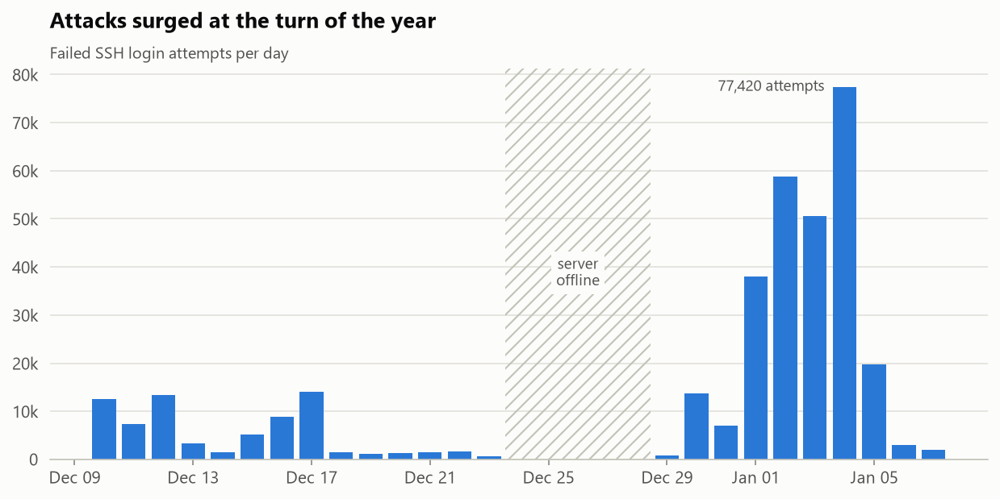
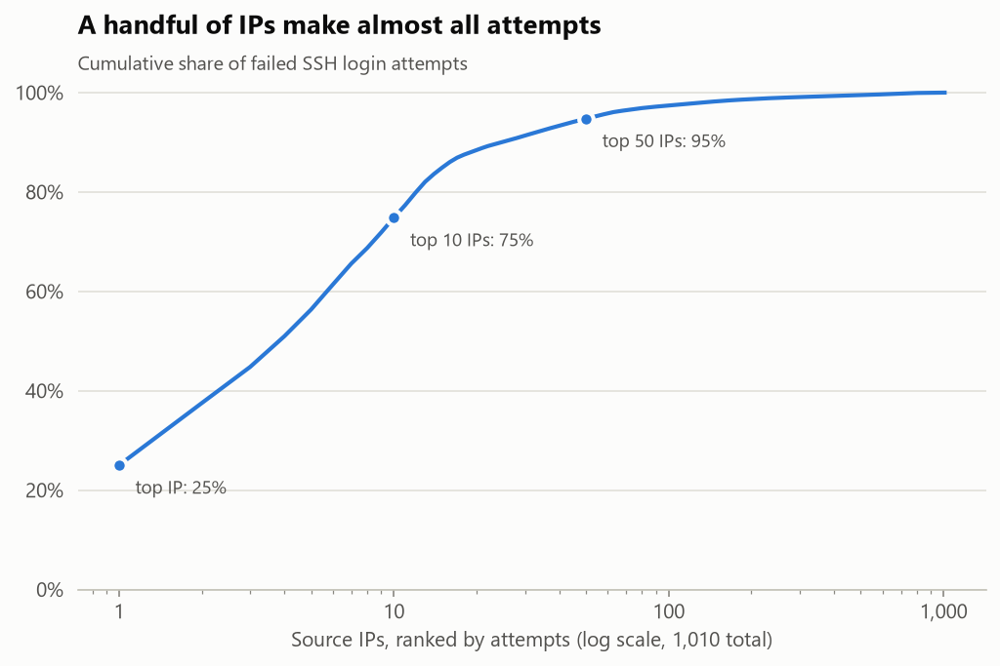
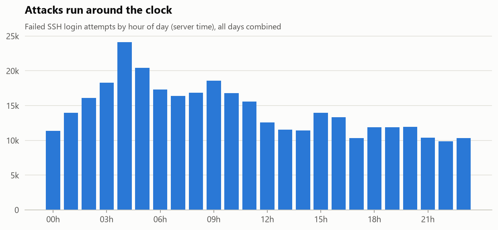
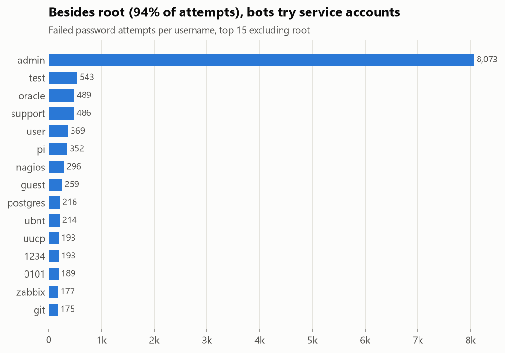
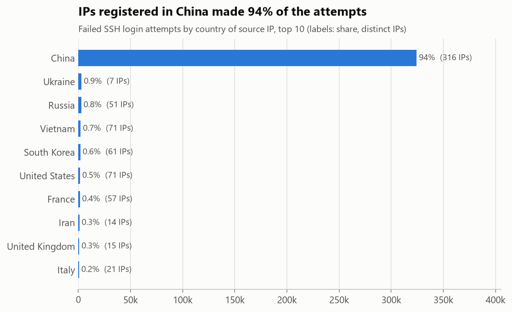
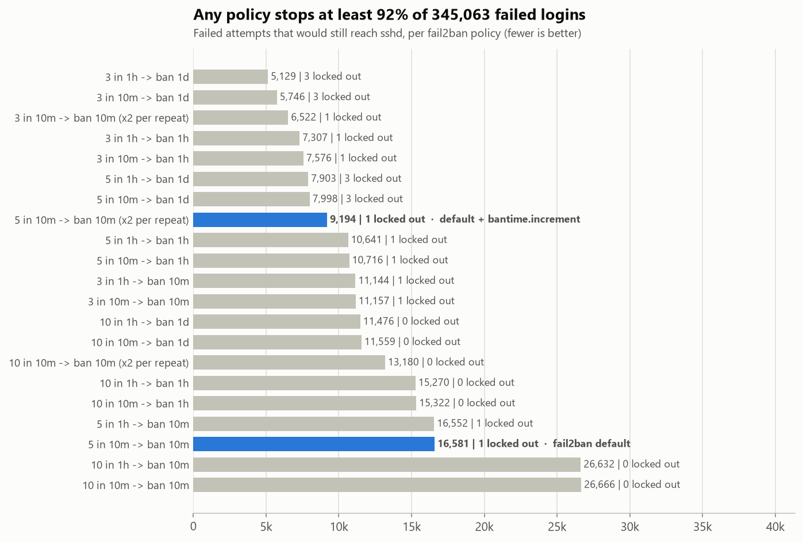
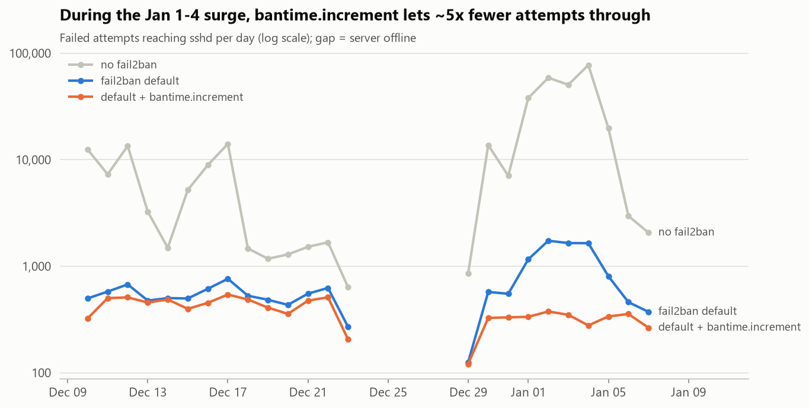

# SSH Brute-Force Analysis

[](https://github.com/JoaoPedro0305/ssh-bruteforce-analysis/actions/workflows/tests.yml)

Analysis of 655k real SSH log lines from an internet-facing server: who tries to break in, with which usernames, from where, and how many attacks a `fail2ban` policy would have blocked.

## The problem

Any server with port 22 open to the internet receives automated login attempts within minutes. This project parses a real `sshd` log, turns it into structured data and answers: how many attacks, when, from where, which users are targeted, and how much a simple blocking rule would actually help.

## Data

- **Source:** the OpenSSH dataset from [Loghub](https://github.com/logpai/loghub), 655,147 lines (~70 MiB) of `sshd` logs collected over ~28 days from a lab server exposed to the internet.
- **Not committed:** the log is downloaded by `scripts/download_data.py` into `data/raw/`, which is git-ignored. Loghub asks users to link back to the original repository instead of redistributing the data.
- **Geolocation:** [IP to Country Lite](https://db-ip.com/db/download/ip-to-country-lite) by DB-IP (CC BY 4.0, no account needed), also downloaded by `scripts/download_data.py`.
- `data/sample/auth_sample.log` is a small **synthetic** log (documentation IP ranges) used by the tests.

## Results

| Metric | Value |
|---|---|
| Log lines parsed | 655,147 |
| Authentication attempts | 345,245 |
| Failed attempts | 345,063 |
| Successful logins | 182 |
| Source IPs with failed attempts | 1,010 |
| Share of attempts from the top 10 IPs | 74.8% |
| Countries | 72 |
| IPs flagged as brute force (banned at least once by fail2ban defaults) | 665 of 1,010 |
| Failed attempts blocked by fail2ban defaults (simulated) | 95.2% |
| ... with `bantime.increment` | 97.3% |
| Legitimate logins locked out (either policy) | 1 of 182 |

**Top 5 targeted usernames:** `root` (94.0%), `admin` (2.3%), `test`, `oracle`, `support`.

Attacks are extremely concentrated: the single most active IP made 25% of all failed attempts (86k in 3 days), and the top 50 IPs made 95%. Blocking a handful of sources removes most of the noise, which is why tools like `fail2ban` work.

Full analysis: [`notebooks/01_exploration.ipynb`](notebooks/01_exploration.ipynb).

### Volume is bursty: Jan 1-4 produced 65% of all attempts



The median online day had ~6k failed attempts. The hatched area is the period when the server was unreachable (see *Data quality notes*).

### A few fast bots, not more attackers



The top 7 IPs tried **only `root`**, at 20-28 attempts per minute for 15-50 hours straight. Two IPs made exactly 10,852 attempts over 51 usernames, three weeks apart: almost certainly the same tool and wordlist.

### There is no real peak hour



Attempts per hour vary 2.5x, but the number of distinct attacking IPs per hour only varies between 82 and 128. The same population attacks all day; the "peaks" are a few heavy bots.

### Usernames: root, then service accounts



94% of failed passwords target a username that exists on the server, mostly `root`. Disabling SSH root login would turn nearly all of them into guaranteed failures.

### Countries: volume is not headcount



IPs registered in China are 316 of the 1,010 sources but 94% of the attempts; Vietnam has 71 IPs and under 1%. The country is where the infrastructure is registered, not where the attacker sits.

## How the parser works

`src/parser.py` turns each authentication attempt into one event (timestamp, IP, port, username, method, success, invalid user). A few things in real `sshd` logs make this less trivial than one regex:

- **One attempt, many lines.** A single failed password also produces `pam_unix`, `Invalid user` and `Disconnecting` lines. Only the `Failed ...` / `Accepted ...` line is counted, so nothing is counted twice.
- **"message repeated N times".** syslog collapses identical consecutive lines into `message repeated 5 times: [ Failed password ... ]`, meaning 5 attempts *in addition* to the previous line. In this dataset these lines hide **184,011 of 345,245 attempts (53%)**. A parser that ignores them counts less than half of the attacks.
- **No year in timestamps.** The year starts at `--start-year` and goes up when the month goes backwards (Dec → Jan). The dataset runs from 2017-12-10 to 2018-01-07.
- **Odd usernames.** Attackers try names with leading spaces (`" 0101"`), so the username is matched up to the `from <ip> port` tail instead of up to the first space.

The parser's total matches an independent `grep`/`awk` count of the raw file exactly (345,245 events).

## Storage

`src/storage.py` loads the events into SQLite (`data/processed/ssh.db`, table `auth_events`), one row per attempt so `COUNT(*)` is the number of attempts. Each load replaces the table in a single transaction: running it twice gives the same result, and a crash halfway keeps the previous data. Exploration queries are in [`sql/exploration.sql`](sql/exploration.sql).

## Data quality notes

- **Gap from 2017-12-23 10:20 to 2017-12-29 17:24.** No external traffic at all; on Dec 26 `sshd` logs `Server listening on ... port 22` with low PIDs, i.e. the server was restarted, and only an internal address shows up. The server was likely offline or unreachable over the holidays. Daily averages exclude these days.
- **Legitimate users are not published.** Successful logins belong to real lab users, so their usernames are left out of this README; only usernames tried by attackers are shown.

## fail2ban simulation

How many attacks would `fail2ban` have stopped, and at what cost? [`src/simulation.py`](src/simulation.py) replays the 345k events in time order through fail2ban's logic: when an IP reaches `maxretry` failures within `findtime`, it is banned for `bantime`.

- An attempt from a banned IP is **blocked** and does not count as a failure (it never reaches sshd).
- The failure that triggers a ban is not blocked: fail2ban acts after seeing it.
- A successful login from a banned IP is a **locked-out user**, the cost of the policy.
- `bantime.increment` doubles the ban each time the same IP is banned again.

**Brute-force detection** uses the same rule: an IP is flagged when fail2ban's defaults (5 failures in 10 minutes) would ban it at least once. That flags **665 of the 1,010** attacking IPs.

21 policies were tested (full results in [`reports/fail2ban_policies.csv`](reports/fail2ban_policies.csv), analysis in [`notebooks/02_fail2ban_simulation.ipynb`](notebooks/02_fail2ban_simulation.ipynb)):



| Policy | Blocked | Reaching sshd | Logins locked out |
|---|---|---|---|
| No fail2ban | 0% | 345,063 | 0 |
| fail2ban default (5 in 10m, ban 10m) | 95.2% | 16,581 | 1 |
| **Default + `bantime.increment`** | **97.3%** | **9,194** | **1** |
| Default with a 1-day ban | 97.7% | 7,998 | 3 |
| Strictest tested (3 in 1h, ban 1d) | 98.5% | 5,129 | 3 |



Findings:

1. **The default alone cuts attempts reaching sshd ~20x**, from 345k to 16.6k.
2. **`bantime.increment` is the best trade-off.** 45% fewer attempts get through than with the default (5x fewer during the Jan 1-4 surge) with no extra locked-out users. Stricter rules gain about one more point and triple the lockouts.
3. **What gets through is mostly bots coming back.** Under the default, 84% of the attempts that still reach sshd come from IPs that were banned and returned after each 10-minute ban, which is exactly what `bantime.increment` fixes. Only 16% come from "low and slow" IPs that never cross the threshold.
4. **The one locked-out login** is a user who failed 5 times in 30 minutes before getting the password right.

Recommended `/etc/fail2ban/jail.local`:

```ini
[sshd]
enabled = true
maxretry = 5
findtime = 10m
bantime = 10m
bantime.increment = true
```

Plus, in `/etc/ssh/sshd_config`, `PermitRootLogin no` and `PasswordAuthentication no`: 94% of attempts target `root`, and with key-only login the remaining password guesses cannot succeed at all.

*Caveat:* the replay assumes attackers behave the same when banned. Many bots give up or move on, so real-world numbers would likely be at least this good.

## How to run

```bash
python -m venv .venv
source .venv/bin/activate        # Windows: .venv\Scripts\activate
pip install -r requirements-dev.txt -r requirements-notebooks.txt
python scripts/download_data.py
python -m src.parser data/raw/SSH.log --start-year 2017    # summary only
python -m src.storage data/raw/SSH.log --start-year 2017   # load into SQLite
python -m src.geo                                          # add countries
python -m src.simulation                                   # fail2ban policy grid -> reports/fail2ban_policies.csv
jupyter nbconvert --to notebook --execute --inplace notebooks/*.ipynb
pytest
ruff check . && ruff format --check .
```

Dependencies are pinned to exact versions and split by use: `requirements.txt` (the analysis), `requirements-dev.txt` (tests and lint) and `requirements-notebooks.txt` (Jupyter).

## Project structure

```
data/
  raw/         # downloaded dataset (git-ignored)
  processed/   # SQLite database (git-ignored)
  sample/      # synthetic sample log for tests
notebooks/     # exploratory analysis
scripts/       # dataset download
sql/           # exploration queries
src/           # parser, storage, geolocation, fail2ban simulation, chart style
tests/         # pytest
reports/       # policy results (CSV) and charts used in this README
```

## Stack

- **Python + regex** – parsing `sshd` log lines
- **pandas** – aggregation
- **SQLite** – simple, file-based storage, no server needed
- **matplotlib** – charts
- **geoip2** – IP → country lookup (reads DB-IP's `.mmdb` format)
- **Jupyter** – exploratory analysis
- **pytest** – tests for parser, storage, geolocation and the simulation
- **ruff** – lint and format check for the code and the notebooks, including bugbear and bandit security rules
- **GitHub Actions** – lint and tests on every push and pull request, on Python 3.11, 3.12 and 3.13
- **Dependabot** – monthly pull requests for new versions of the pinned dependencies and GitHub Actions

## Limitations and next steps

- One server over ~28 days, so the results describe that server, not the whole internet.
- Log lines have no year, so dates are inferred from the December → January rollover.
- Country of an IP is not the attacker's real location (VPNs, botnets, proxies), and IP-to-country data from today may differ from when the logs were collected.
- The fail2ban numbers are a simulation: real attackers may change behavior once they get banned.

## Acknowledgements

IP geolocation by [DB-IP](https://db-ip.com), licensed under [CC BY 4.0](https://creativecommons.org/licenses/by/4.0/).

Dataset from Loghub:

> Jieming Zhu, Shilin He, Pinjia He, Jinyang Liu, Michael R. Lyu. *Loghub: A Large Collection of System Log Datasets for AI-driven Log Analytics.* IEEE International Symposium on Software Reliability Engineering (ISSRE), 2023.

## License

Code: MIT. Dataset: see [Loghub](https://github.com/logpai/loghub).
